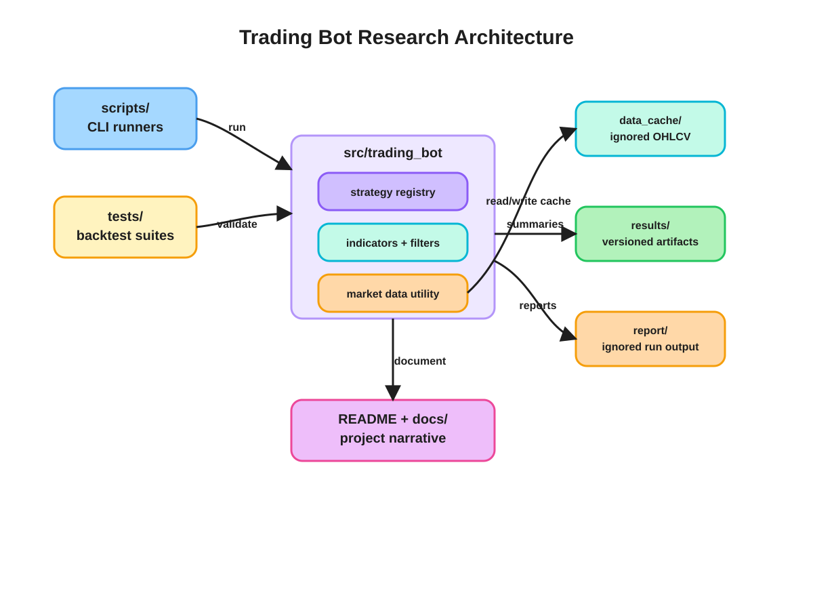
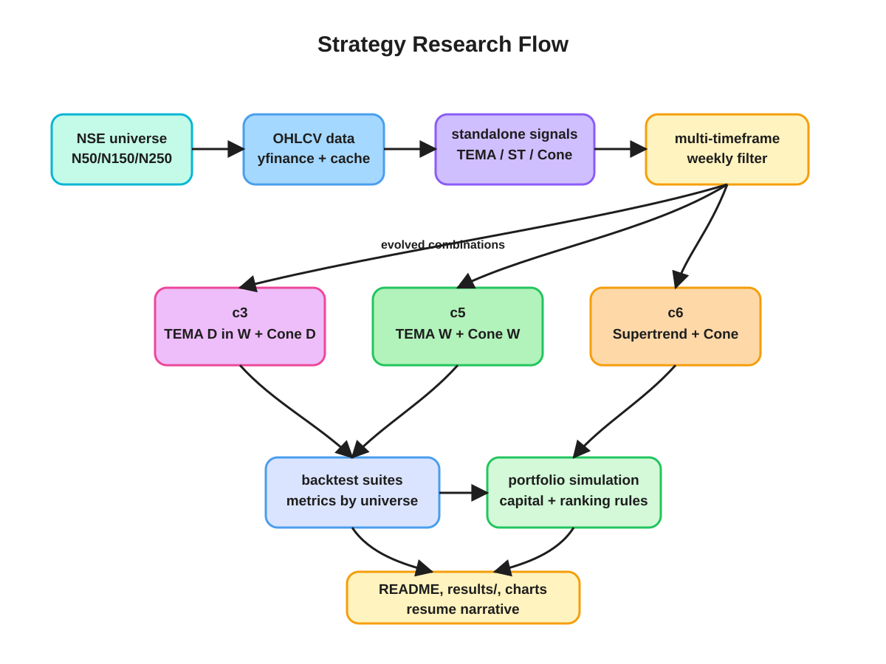

# NSE Quantitative Strategy Research and Backtesting

Python research project for NSE equity screening and backtesting. The project compares standalone indicators, multi-timeframe confirmations, and projection-cone filters across N50, N150, and N250 universes.

**Disclaimer:** This repository is for research and educational review only. It is not financial advice, investment advice, a recommendation to buy or sell securities, or live execution software. It does not include broker integration, order placement, portfolio authorization, or risk controls required for production trading.

## Repository Layout

- `src/trading_bot/` - strategy library, indicators, screeners, market-data utilities, and monitoring helpers.
- `tests/` - deterministic regression tests and fixture data.
- `research/` - historical research runners and shared research backtest support.
- `scripts/` - command-line runners for reports, backtests, simulations, and visualizations.
- `results/` - consolidated backtest outputs, plots, summaries, and c5/c6 portfolio simulation artifacts.
- `docs/` - working notes and strategy evolution notes.
- `report/` - generated strategy reports; ignored by git.
- `data_cache/` - local downloaded OHLCV cache; ignored by git.
- `pine/` - local TradingView/Pine scripts; ignored by git.

```text
trading_bot/
├── README.md
├── LICENSE
├── pyproject.toml
├── docs/
│   ├── assets/
│   │   ├── architecture-overview.svg
│   │   └── research-flow.svg
│   ├── notes.md
│   ├── strategy-evolution.md
│   └── methodology.md
├── scripts/
│   ├── run_strategies.py
│   ├── run_backtests.py
│   ├── run_tw_combinations.py
│   ├── simulate_c5_c6_portfolio.py
│   ├── visualize_results.py
│   └── backtest_tema_macd_projection_cone.py
├── src/
│   └── trading_bot/
│       ├── projection_cone.py
│       ├── utility/
│       ├── tema_macd/
│       ├── supertrend/
│       ├── mtf/
│       ├── strategy/
│       │   ├── standalone/
│       │   └── combination/
│       └── monitor/
├── tests/
│   ├── fixtures/
│   └── test_sample_data.py
├── research/
│   ├── backtests/
│   │   ├── standalone/
│   │   └── combination/
│   └── support/
├── results/
│   ├── visuals/
│   └── c5_c6_simulation/
├── report/       # ignored generated run reports
├── data_cache/   # ignored raw OHLCV cache
└── pine/         # ignored TradingView/Pine scripts
```

## Architecture

The source package contains reusable strategy logic; the scripts and research runners are thin entry points around it. Generated reports and raw data stay local, while curated result summaries and plots stay versioned for the project narrative.



The research loop starts with broad NSE universes, builds standalone signals, adds multi-timeframe confirmation, and then filters entries using projection-cone sigma zones. The strongest candidates are summarized in result artifacts and c5/c6 portfolio simulations.



## Setup

```bash
python -m venv .venv
source .venv/bin/activate
python -m pip install --upgrade pip uv
uv sync --frozen --all-extras
```

The code uses `yfinance` for raw OHLCV data. Cached downloaded data is written to `data_cache/` and intentionally excluded from git.

Verify a clean clone without external market-data calls:

```bash
uv run pytest -q -m "not network and not slow"
uv run python -c "from trading_bot.strategy.registry import run_strategy; print('import ok')"
```

`tests/fixtures/data_cache/` contains a tiny deterministic OHLCV fixture for this smoke test. The deterministic tests patch the downloader boundary so accidental network access fails the test. Full historical scans still use `yfinance` unless you already have a populated local `data_cache/`.

## Usage

Generate current strategy reports:

```bash
python scripts/run_strategies.py --mode=combination --strategy=5,6 --min-negative-sigma=2.0
python scripts/run_tw_combinations.py --mode=combination --strategy=c5,c6 --cone-threshold=2.0
```

Run historical backtests:

```bash
python scripts/run_backtests.py --mode=standalone --strategy=1,2,3
python scripts/run_backtests.py --mode=combination --strategy=3 --universe=N50 --range=0,49 --chunk-size=5 --max-workers=4 --min-negative-sigma=-0.68
```

Refresh raw market data instead of using the local cache:

```bash
python scripts/run_strategies.py --mode=combination --strategy=5,6 --refresh-data
```

Rebuild result visualizations from `results/all_res.md`:

```bash
python scripts/visualize_results.py
```

Run the c5/c6 portfolio simulation:

```bash
python scripts/simulate_c5_c6_portfolio.py
```

## Engineering Highlights

- `src/` package layout keeps reusable strategy logic separate from scripts, generated outputs, and backtest harnesses.
- Strategy discovery is centralized in `trading_bot.strategy.registry`, so standalone and combination strategies have a consistent runner interface.
- Market data access is wrapped by `MarketDataStore`, which supports cached OHLCV reads and deterministic fixture-backed tests without network access.
- Deterministic regression tests live under `tests/`. Historical research runners live under `research/backtests/` and may require cached or externally downloaded market data.
- Generated reports, raw market caches, Pine scripts, bytecode, virtual environments, local holdings, and editor/agent state are excluded from git.

## Universe Definitions

- `N50`, `N150`, and `N250` are static ticker lists maintained in `trading_bot.utility` and mapped to Yahoo Finance `.NS` symbols.
- They are intended to approximate NSE large-cap and broader equity universes, but they are not yet linked to a point-in-time constituent database.
- Current backtests may apply today's/static constituents historically. That means survivorship bias and index-membership look-ahead are not fully controlled.
- Delisted securities are not explicitly modeled unless they remain available in the local data source.

These limitations are material. See `docs/methodology.md` before interpreting any performance artifact.

## Strategy Evolution

The strategy set evolved in three stages:

1. Standalone signals: TEMA-MACD, Trend Supertrend, and Projection Cone were tested independently on daily and weekly candles.
2. Multi-timeframe filters: daily entries were gated by weekly trend state to reduce noise.
3. Projection-cone combinations: TEMA-MACD or Supertrend entries were filtered by cone sigma location to prefer discounted entries.

Current active research emphasis:

- `c5`: weekly TEMA-MACD fresh bull signal with weekly projection-cone filter.
- `c6`: Supertrend fresh buy signal on daily/weekly timeframes with matching projection-cone filter.
- Portfolio simulation uses `c5 W/W`, `c6 D`, and `c6 W`, with `c5 D/W` omitted in the latest simulation.

More notes are in `docs/strategy-evolution.md`.

## Interpretation Limitations

The included outputs are research artifacts, not independently verified investment-performance records. Unless explicitly stated in an individual report, simulations may not account for brokerage, taxes, exchange fees, bid-ask spread, slippage, market impact, liquidity limits, partial fills, corporate-action edge cases, survivorship bias, or point-in-time index membership.

Historical data is obtained through `yfinance` and may be revised or differ from exchange-authoritative datasets. Results should not be interpreted as expected future performance.

## Backtest Results

Key included artifacts:

- `results/visuals/summary_metrics.md` - summarized strategy metrics by universe.
- `results/visuals/*.png` - risk/return, duration/return, universe heatmaps, and cone bucket plots.
- `results/c5_c6_simulation/report.md` - latest c5/c6 portfolio simulation narrative and annual table.
- `report/` - generated active screens and dated reports, kept locally and ignored by git.

Selected descriptive metrics from the included result summaries:

| Strategy | Universe | Trades | Avg Return % | Win Rate % | Median Duration |
| --- | --- | ---: | ---: | ---: | ---: |
| TEMA-MACD MTF | N250 | 14,755 | 2.53 | 40.43 | 13 days |
| Supertrend MTF | N250 | 2,239 | 12.18 | 48.19 | 56 days |
| Combination Strategy 3 | N250 | 4,261 | 3.23 | 40.86 | 14.4 days |

Illustrative c5/c6 simulation output under the repository's current, simplified assumptions:

- Full details are kept in `results/c5_c6_simulation/report.md`.
- The simulation currently requires independent review of signal timing, transaction costs, survivorship bias, capital allocation, and candidate-ranking assumptions.
- The candidate-ranking rule must use only information available at entry. Any use of realized future holding duration would be look-ahead leakage.

## Data and Artifact Licensing

The software source code is provided under the repository license. Downloaded market data remains subject to the terms of its original provider. Committed fixture data and generated research artifacts are included solely to reproduce and review the software's behavior.

## Git Hygiene

The repository keeps curated result summaries and plots because they are part of the project story. It ignores generated reports, raw downloaded data, virtual environments, bytecode, scratch holdings, local agent/editor state, and Pine scripts.

Before pushing a previously tracked local cache to GitHub, untrack ignored files without deleting them:

```bash
git rm -r --cached --ignore-unmatch \
  .venv \
  data_cache \
  pine \
  report \
  reports \
  hold.csv

git ls-files -z '*__pycache__*' | xargs -0 -r git rm -r --cached --ignore-unmatch
git add .
git status --short
```
